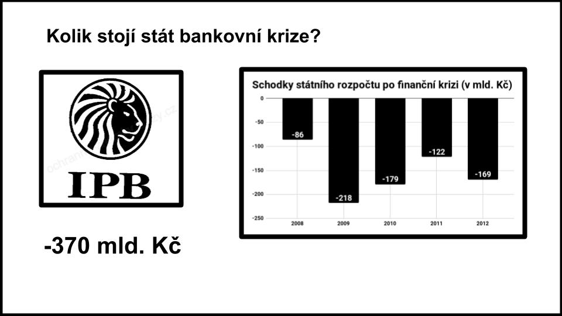
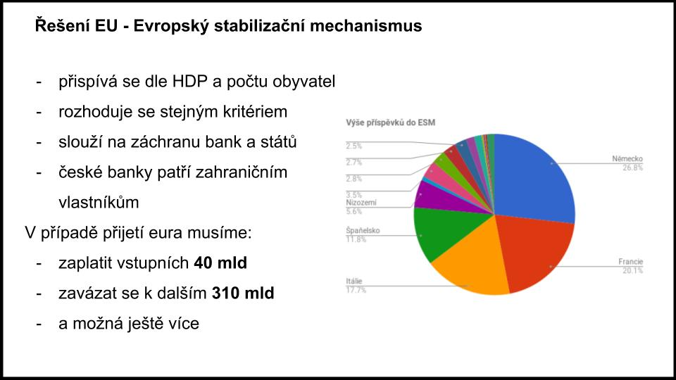
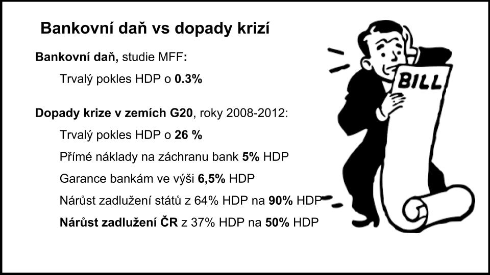
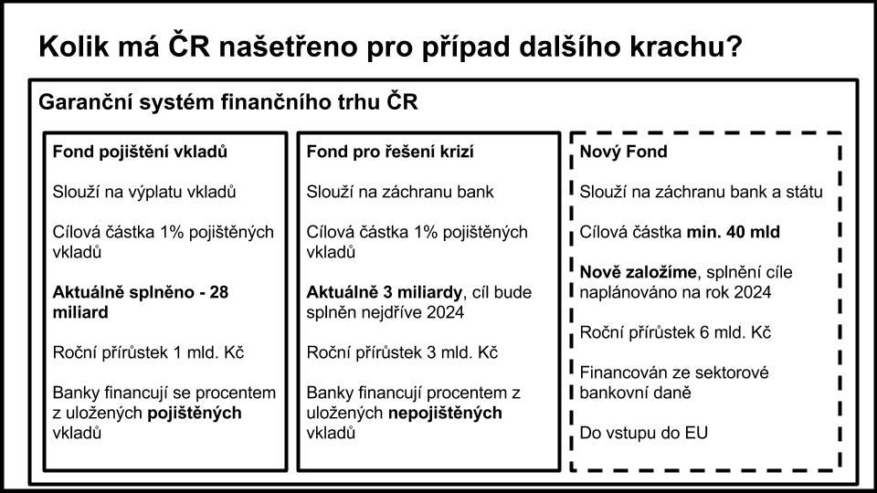

Banky, které se postarají samy o sebe
-------

Pirátská strana dlouhodobě kritizuje ekonomický model postavený na
neustálém růstu zadlužení, který je dlouhodobě neudržitelný.
Ostře odmítáme záchranu bank z peněz daňových poplatníků,
bankovní sektor si musí sám vytvořit dostatečný finanční
polštář, aby ustál otřesy finančního trhu. Sektorovou daň pro
banky vnímáme jako nejvhodnější prostředek, jak v rámci
současných evropských pravidel k tomuto cíli dospět. 

O
přesné <a href="https://www.novinky.cz/ekonomika/55697-prechod-k-trzni-ekonomice-stal-cr-700-miliard-korun.html">výši
nákladů</a> na bankovní krize se můžeme dohadovat, s
určitostí se ale dá říci, že jde o stovky miliard, naproti tomu
v případě bankovní daně se bavíme o přínosu 10 miliardách
ročně.

Během
předchozí krize v roce 2008 náš stát sice banky zachraňovat
nemusel, přesto pokles ekonomiky způsobil sta miliardové státní
deficity. Za příchod globální krize sice české banky nemůžou,
ale čím zadluženější budou česká podniky, občané nebo stát,
tím horší budou dopady.  Levné půjčky, hypotéky a úvěry mají
i svou <a href="https://www.imf.org/external/np/seminars/eng/2010/paris/pdf/090110.pdf">odvrácenou
tvář.</a> A s určitostí se dá také říct, že další
krize <a href="http://www.euro.cz/byznys/10-dobrych-duvodu-proc-se-svetove-trhy-opet-propadnou-1348243">příjde.</a>

Po
krizi v roce 2008 vznikla řada opatření (BASEL II, BASEL III,
IFRS9, CRD IV atd.), která zvyšovala nároky na kapitálovou
přiměřenost, zpřísnila účetní metodiky a dohled nad
finančními institucemi. Mnoho velkých bank v eurozóně ale i po
10 letech plní tato kritéria s <a href="https://en.wikipedia.org/wiki/2016_European_Union_bank_stress_test">elkými
obtížemi</a>. Českého bankovního sektor je na tom o
něco lépe. Domníváme se proto, že bychom k eurozóně měli
přistoupit, až bude její bankovní sektor více stabilizován.
Postupné navyšování kapitálu těchto bank je <a href="http://www.mckinsey.com/business-functions/risk/our-insights/basel-iv-whats-next-for-european-banks">rozplánováno
až do roku 2025</a>.  

Na
falešnou jistotu, kterou současná bankovní regulace vytváří,
upozorňují nejen <a href="https://www.gsb.stanford.edu/faculty-research/excessive-leverage/healthy-banking-system-goal">akademici</a>,
ale i <a href="http://www.bis.org/speeches/sp161128.pdf">samotný
trh</a>.  Ten si vynutil vytvoření Evropského
stabilizačního mechanismu (dále <a href="https://cs.wikipedia.org/wiki/Evropsk%C3%BD_stabiliza%C4%8Dn%C3%AD_mechanismus">ESM</a>).
ESM slouží k záchraně evropských bank a států v potížích,
jednotlivé státy eurozóny do něj přispívají podle výše HDP a
počtu obyvatel. Rozhoduje se dle stejného kritéria. Do přistoupení
k Euru do něj nemusíme přispívat. V případě přijetí eura by
z něj mohly být zachraňovány i české banky, avšak pouze pokud
by je ESM považoval za dostatečně významné. V případě vstupu
bychom ale museli zaplatit úvodní vklad ve výši 40 miliard a
zaručit se vložit dalších 310 miliard. Navíc horní hranice je
pouze formální, reálně je to bianko šek do neomezené výše.
Protože přijetí eura je v dlouhodobném horizontu velmi
pravděpodobní, navrhujeme proto již nyní založit fond, který by
byl financován z nově zavedené bankovní daně. Do doby
přistoupení k euru bude tento fond využitelný i v případě
potíží českého bankovního sektoru. Výši daně nastavíme tak,
aby v roce 2024 dosáhl výše požadovaných 40 miliard.

Bankovní
sektor je u nás převážně vlastněn velkými zahraničními
bankami. České banky jsou jedny z jejich nejvýdělečnějších
dcer. Ročně odvádějí svým zahraničním matkám okolo 70
miliard korun, na daních českému státu odvedou cca 13-15 miliard
korun. Považujeme proto za logické vybrat potřebných 40 mld.
vyšším zdaněním právě jejich českých dcer. Přišlo by nám
proto přiléhavé pojmenovat tento fond jako “Fond na záchranu
zahraničních matek” (FZZM).

V
případě bankrotu banky v ČR by ČNB nejprve čerpala peníze z
Garančního systému finančního trhu. Ten se nyní skládá ze
dvou částí - zaštiťuje Fond pojištění vkladů a Fond pro
řešení krize.

Ve
Fondu pojištění vkladů jsou aktuálně k dispozici finance na
méně než 1%  pojištěných vkladů (tj. cca 27 miliard) v českých
bankách. V případě, že by finance ve fondu nepostačovaly,
vyplácí pojištěné vklady vláda.  Navíc pokud objem prostředků
ve fondu dosáhne výše 1% z pojištěných vkladů, podle
současného zákona se příspěvky bank sníží na polovinu.
Posuneme tuto hranici snížení až ke 2%.

Fond
pro řešení krize slouží k financování bank, které se dostanou
do potíží, ale jsou ještě životaschopné. Fond byl založen
loňského roku s plánem dosáhnout financí ve výši 1%
pojištěných vkladů v roce 2024. Existence fondu je v EU povinná
i pro země bez eura. S přistoupením k eurozóně se tento fond
automaticky převede do evropského Jednotného fondu pro řešení
krizí. Proto je třeba pro účely ESM zřídit další fond.

Fond
je v okolních státech financován právě z bankovní daně. Bývalý
premiér Fisher sice pro ČR vyjednal výjimku ze zavádění
bankovní daně, fond samotný však zřídit musíme. Klasická
švejkovina - sektorovou bankovní daň banky platit nemusí, jenom
příspěvky do fondu :-). Novou bankovní daň proto navrhneme
podobně jako v ostatních evropských zemích, kde je založena na
velikosti a rizikovosti finančních aktiv banky.

Zavést
bankovní daň však nestačí. Je třeba omezit morální hazard
akcionářů a dát jim jistotu, že v případě potíží o své
akcie přijdou. V tomto bodě je třeba EU pochválit, neboť udělala
významný krok správným směrem, když zavedla směrnici, která
významně omezuje pravomoci státu finančně pomáhat bankrotující
bance. Jde o zavedení tzv. bail-inu namísto bail-outu, který se
často používal během předchozí krize. Rozdíl je zásadní. V
případě bail-inu nedochází k pomoci ze strany státu, ale
současní akcionáři jsou zbaveni svých práv, a z velkých
nepojištěných věřitelů  se stávají vlastníci banky.

Mohlo
by se zdát, že je vyhráno, ale není. Pomoc je za jistých
okolností možné poskytnout, což se stalo krátce po zavedení
bail-inu v případě obtíží nejstarší a největší italské
banky Monti di Pasco. Je velká neznámá, jak by reagovala německá
vláda, kdyby se spekulace o možném bankrotu Deutsche bank staly
realitou. Angela Merklová státní pomoc nevyloučila. Podobně
pravidla o rozpočtové kázni byla také vyžadována pouze do doby,
než se do obtíží dostalo Německo. Současná legislativa tyto
postupy umožňuje, nikoliv vynucuje. Je třeba je explicitně
zakotvit do zákonů, aby politici v rozhodujících situacích
odolali lobbistům.

Dále
je třeba odmítnout současnou praxi, kdy se krach menší banky
řeší prodejem velkým finančních kolosům, často jen o něco
málo lépe kapitálově vybaveným. V důsledku toho velké banky,
které byly příliš velké na to aby padly, během krize ještě
narostly. Proto je třeba před prodejem krachují banky jiné velké
bance preferovat obnovení její samostatné funkce s novými
akcionáři, případně ji ještě dále rozdělit. Dále je třeba
prosazovat oddělení investičních a obchodních bank.

<h2>FAQ</h2>

<b >V
minulé krizi ale stát banky zachraňovat nemusel, nestačí
současný stav?</b>

Banky
sice vyšly z předchozí krize dobře, ale především díky tomu,
že finanční inovace ze západu v podobě různých složitých
derivátů, sekuritizací hypoték apod.se u nás ještě nestihly
plně rozvinout. Češi jsou navíc od té doby mnohem zadlužeňější.
Navíc úrokové sazby jsou a pravděpodobně ještě dlouho budou
blízko nule - ČNB tak už nemá k dispozici klasický nástroj
první pomoci.

<b >Neměly
by se krachující banky nechat úplně padnout?</b>

I
když ČR nemusela během krize pomáhat svým bankám, snížení
příjmů státního rozpočtu vedlo ke zvýšení státního
zadlužení o 13% HDP. V případě opravdového pádu velké banky
by toto číslo bylo ještě hrozivější. Proto v případě pádu
příliš velkých bank (too big to fail) nebo systémových krizí
je nutné pomoc bankovnímu sektoru poskytnout, neboť opak by měl
na státní rozpočet ještě horší dopady. Veškeré operace v
případě potíží banky však musí provádět ČNB, a musí být
podmíněné ztrátami akcionářů.  ČNB má nástroje, jak
případné negativní dopady (prudký pokles ekonomiky, inflace)
správně vybalancovat. Její zadlužení je čistě virtuální
číslo, které není na rozdíl od státního dluhu nutné splácet
soukromým investorům. Americký FED navíc ukázal, že na takovéto
pomoci bankám lze i vydělat. Snaha oddělit propojenost
solventnosti bank a států je silná i na evropské úrovni.

 

<b >Proč
teď?</b>

Jak
již bylo řečeno výše, český bankovní sektor je na tom v
porovnání s eurozónou dobře. Počty nesplácených hypoték jsou
na minimální úrovni, ceny bytů letí do závratných výšin.
Právě proto je dobrá doba diskutovat o tom, co bude, až tomu tak
nebude. Dosud totiž platí, že v případě potíží velkých bank
státy vydávají narychlo a na míru šité zákony a vlády
podléhají vlivu různých lobbistických skupin. To je špatně. V
těchto krizových situacích se nemá s akcionáři vyjednávat, ale
postupovat rychle, efektivně a podle platného práva. Je třeba
postupy explicitně zakotvit do zákonů.

 

<b >Neměly
by se omezi odměny bankéřů?</b>

Rozložení
těchto odměn a limitace její variabilní složky je již EU
regulována dostatečně, za to její třeba také pochválit. Stále
je však velmi těžké někoho obvinit v případě úmyslného
zkreslování finančních údajů. Je nehorázné, že zatímco
běžný drobný podnikatel po obchodním neúspěchu skončí v
dluhové pasti mnohdy do konce pracovního života, žádný z
vysokých bankovních manažerů nebyl a nejspíše ani nebude za
finanční krizi potrestán. Naopak dále pobírají vysoké odměny
v jiných finančních institucích. V případě, že banka nečekaně
padne, měla by být jejím manažerům zakázána další práce ve
finančním sektoru nebo na jiných vysokých postech.

Zdroj
obrázku: ihned.cz
